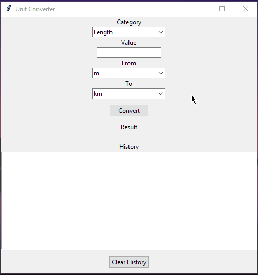

# **Group 07 - Unit Converter with History**
A Python Unit Converter app built with Tkinter GUI.
The app lets you convert between Length, Mass, and Temperature units.
It also saves past conversions into a history file so users can view them later.

##  📖 Project Summary
This project is a Unit Converter Application built with Python.
The app provides a user-friendly interface for performing unit conversions and keeping a history of results

### Features
* Convert between Length, Mass, and Temperature
* Save conversion history into a JSON file
* Display history in GUI
* Clear history button
* Automated tests with pytest

### Requirements
- Python 3.10+
- pipenv (for environment & dependencies)

##  ⚙️ Setup Instructions
Run the following commands in **Git Bash**:

* Clone the Repository
```bash
git clone https://github.com/abdulazeemsodimu/group07-unit-converter
cd group07-unit-converter
```

### Installation
Run the following commands in **Git Bash**:

* Set up environment
```bash
# 1. Install pipenv if you do not have it
pip install pipenv

# 2. Create the virtual environment and install dependencies with your Python version (3.10, 3.11, 3.12)
pipenv install --dev --python 3.10
# or
pipenv install --dev --python 3.11
# or
pipenv install --dev --python 3.12
```

* Activate the virtual environment
```bash
pipenv shell
```

* Run the app
```bash
pipenv run python src/gui.py
```

* Run Tests
```bash
pipenv run pytest
```

## Troubleshooting
1. I get an error about Python version mismatch. What should i do?
    - Make sure you have *Python 3.10, 3.11 or 3.12* installed
    - Check your Python version:
      ```bash
      python --version
      ```
    - If you have a different version, install one of the supported versions from python.org
    - When installing dependencies, specify the Python version explicitly
      ```bash
      pipenv install --dev --python 3.10  # or replace 3.10 with your installed version (3.11 or 3.12).
      ```
2. How do I exit the pipenv shell?
    - Simply type:
      ```bash 
      exit  # or press Ctrl+D.
      ```
      
3. Can I use a different Python version than 3.10, 3.11, or 3.12?
    - The project has been tested on these versions in CI and is expected to work.
    - Using other versions *may* cause unexpected issues.
    - If you want to try, specify your Python version explicitly when installing dependencies:
      ```bash
      pipenv install --dev --python <your_version>
      ```
4. I get errors when running pipenv install. How can I fix this?
    - Check your internet connection.
    - Make sure you are running the command inside the project directory where the Pipfile is located.
    - Try clearing pipenv caches:
      ```bash
      pipenv --clear
      ```
    - If dependency conflicts occur, verify that your Python version matches the one specified in the Pipfile or the one you used with --python.

## ✅ Continuous Integration
This project uses GitHub Actions to automatically run tests on Python 3.10, 3.11, and 3.12.  
You can view the latest build status under the Actions tab.

## 👥 Team Roles
* Conversion Logic Team – Built converters.py (Length, Mass, Temperature classes)
* History Team – Implemented JSON save/load/clear features (history.py)
* GUI Team – Designed Tkinter interface (gui.py, buttons, dropdowns, history panel)
* Testing Team – Wrote pytest tests for converters and history
* Media Team – Maintains this README, documentation, and presentation materials

## 📂 Project Structure 
```
group07-unit-converter/
├── data/
│ └── history.json
├── src/
│ ├── __init__.py
│ ├── gui.py
│ ├── converters.py
│ └── history.py
├── tests/
│ ├── __init__.py
│ ├── test_converters.py
│ └── test_history.py
├── media/
│ └── Animation.gif
├── report/
│ └── GROUP_7_Final_Report.pdf
├── Pipfile
├── Pipfile.lock
├── README.md
└── .gitignore
```

## 📄 Project Report
Click [here](report/GROUP_7_Final_Report.pdf) for the project report

## 🎥 Demo Video
Click [here](https://drive.google.com/file/d/1BpxtfVRoPZvzqM82a3CIgORrWzJjYE1N/view) to watch the demo

## 📸 Screenshots

